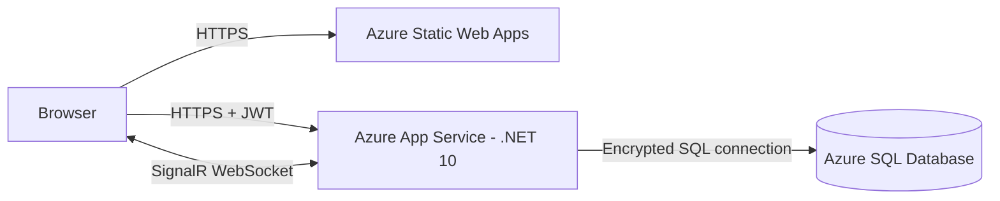

# Wapp2 Deployment Plan

## 1. Objetivo

Este plan prepara una primera publicacion de Wapp2 para aprendizaje y pruebas
con usuarios reales. El resultado sera un ambiente similar a produccion, pero no
debe considerarse un servicio comercial endurecido hasta cerrar el backlog de
seguridad y operacion indicado al final.

La primera entrega sera manual. No requiere GitHub Actions ni otro sistema de
CI/CD. Cada publicacion comienza con la suite local completa y conserva los
artefactos usados para permitir rollback.

## 2. Arquitectura recomendada



| Componente | Servicio inicial | Motivo |
| --- | --- | --- |
| React SPA | Azure Static Web Apps | Sirve el build estatico de Vite y soporta fallback SPA |
| ASP.NET Core API | Azure App Service para Linux | Soporta .NET 10, HTTPS y WebSockets |
| SQL Server | Azure SQL Database | Mantiene el modelo y consultas SQL existentes |
| SignalR | Hub dentro de una unica instancia de App Service | Evita infraestructura adicional en la primera prueba |
| Secretos | App Service settings y connection strings | Evita credenciales en archivos versionados |

La SPA y la API tendran dominios distintos. Por eso CORS y la URL de SignalR
deben configurarse explicitamente. Se mantendra una sola instancia de backend;
si mas adelante se escala horizontalmente, se agregara Azure SignalR Service o
un backplane compatible.

## 3. Decisiones para esta etapa

- El ambiente se llamara `study` o `staging`, aunque se pruebe con URLs publicas.
- No se configura CI por ahora. La puerta de calidad se ejecuta localmente antes
  de cada deploy.
- No se conecta Azure Static Web Apps al repositorio de GitHub. El frontend se
  publica manualmente con Static Web Apps CLI.
- La API se publica como un ZIP generado por `dotnet publish`.
- Las migraciones se ejecutan como una operacion separada antes de publicar la
  API que depende de ellas.
- No se habilita escalado a varias instancias en la primera version.
- Todos los recursos se crean en un unico resource group para identificarlos,
  revisar costes y eliminarlos juntos cuando termine la prueba.

## 4. Estado de preparacion antes del primer deploy

### 4.1 Migracion baseline

`database/baseline.sql` ya crea desde cero:

- `Users`, `UserProfiles`, `Roles` y `UserRoles`;
- `Tasks`, `TaskInvitations`, `TaskAccess` y `Notifications`;
- claves primarias y foraneas;
- indices y constraints;
- el rol inicial `User`;
- una tabla o mecanismo que registre migraciones aplicadas.

La baseline y `20260910_001_task_sharing_constraints.sql` fueron probadas sobre
una base local vacia y despues sobre Azure SQL. Ambas registran su aplicacion y
se pueden volver a ejecutar sin dejar un esquema parcial.

### 4.2 Configuracion por ambiente

`Program.cs` ya lee una lista obligatoria de origenes desde configuracion. En
produccion se usara:

```text
Cors__AllowedOrigins__0=https://<frontend-host>
```

Desarrollo conserva `http://localhost:5173`; produccion acepta unicamente la URL
HTTPS de la SPA. No se debe combinar `AllowAnyOrigin` con credenciales.

Tambien se debe validar al arrancar que estas claves de configuracion existan y
no esten vacias:

```text
ConnectionStrings:DefaultConnection
Jwt__Secret
Jwt__Issuer
Jwt__Audience
Cors__AllowedOrigins__0
```

En App Service, `DefaultConnection` se crea en la seccion de connection strings;
las demas claves se guardan como app settings con separadores `__`.

### 4.3 Health checks y logs

Ya estan disponibles:

- `/health/live`: confirma que el proceso ASP.NET Core responde;
- `/health/ready`: comprueba que la API puede abrir una conexion a SQL Server;

Durante la primera publicacion todavia se debe habilitar App Service log stream
y comprobar que los logs no incluyan JWT, passwords ni connection strings.

App Service consulta `/health/live`, que no despierta ni depende de Azure SQL.
`/health/ready` queda como diagnostico de conectividad. Esta separacion evita que
el auto-pause de una base serverless marque el proceso web como caido.

### 4.4 Validacion y exposicion publica

La regla de fecha minima de cinco horas y las reglas basicas de email y password
ya se validan en frontend y backend. Para esta publicacion de estudio se acepta
aplazar:

- ampliar la validacion de payloads y las politicas de credenciales;
- agregar rate limiting a registro y login;

Antes de abrir la URL igualmente se debe:

- revisar que los errores no expongan excepciones ni SQL;
- usar un secreto JWT largo y generado para este ambiente;
- decidir una duracion razonable del token para pruebas;
- confirmar que no existen secretos en Git ni en los artefactos de build.

Guardar JWT en `sessionStorage` se acepta temporalmente para este ambiente de
estudio. Esto aisla las sesiones por pestana, pero no elimina el riesgo XSS
porque JavaScript todavia puede acceder al token. Una publicacion dirigida a
usuarios externos debe evaluar cookies `HttpOnly`, `Secure` y `SameSite`.

### 4.5 Fallback de la SPA

Azure Static Web Apps necesita devolver `index.html` cuando el navegador abre o
recarga `/tasks`, `/invitations`, `/shared` o `/profile`.
`full-web-app/public/staticwebapp.config.json` ya configura
`navigationFallback`, excluye los assets generados y agrega headers iniciales.
El build comprobado de Vite copia el archivo sin cambios a la raiz de `dist`.

## 5. Orden de implementacion y commits

Trabajar en `deploy/azure-ecosystem` y detenerse en estos checkpoints:

1. `chore: add reproducible database baseline`
   Crea y valida el esquema completo sobre una base vacia.
2. `feat: make production origins configurable`
   Extrae CORS a configuracion y conserva el origen local en Development.
3. `feat: add deployment health checks`
   Agrega liveness, readiness y su cobertura.
4. `fix: enforce task due date on the server`
   Replica la regla de cinco horas y cubre el borde temporal.
5. Parcial: `feat: protect public authentication endpoints`
   La validacion basica de email y password esta aplicada. El rate limiting y
   politicas mas exigentes quedan antes de una exposicion publica prolongada.
6. `chore: configure static app routing`
   Agrega el fallback SPA y headers iniciales.
7. `docs: add manual deployment runbook`
   Sustituye los placeholders de este documento con los nombres elegidos y
   registra el procedimiento probado.

Cada commit debe pasar sus tests enfocados. Antes de publicar la rama se ejecuta
la puerta completa de la seccion 7.

## 6. Preparacion de Azure

### 6.1 Herramientas y nombres

Instalar Azure CLI y Static Web Apps CLI fuera del repositorio. Iniciar sesion y
seleccionar la suscripcion correcta:

```bash
az login
az account show
npx --yes @azure/static-web-apps-cli@2.0.10 --version
```

Definir nombres unicos sin guardar secretos en el shell history:

```bash
export AZURE_RESOURCE_GROUP=<resource-group>
export AZURE_LOCATION=<region>
export APP_SERVICE_PLAN=<app-service-plan>
export API_APP_NAME=<globally-unique-api-name>
export STATIC_APP_NAME=<globally-unique-static-app-name>
export SQL_SERVER_NAME=<globally-unique-sql-server-name>
export SQL_DATABASE_NAME=Wapp2DB
```

No fijar un SKU hasta comprobar su disponibilidad y coste actual en la region.
Para la primera prueba basta una sola instancia que permita .NET 10 y
WebSockets.

### 6.2 Resource group, frontend y backend

Crear primero los contenedores de la aplicacion para conocer sus URLs:

```bash
az group create --name "$AZURE_RESOURCE_GROUP" --location "$AZURE_LOCATION"

az staticwebapp create \
  --name "$STATIC_APP_NAME" \
  --resource-group "$AZURE_RESOURCE_GROUP" \
  --location "$AZURE_LOCATION"

az appservice plan create \
  --name "$APP_SERVICE_PLAN" \
  --resource-group "$AZURE_RESOURCE_GROUP" \
  --location "$AZURE_LOCATION" \
  --is-linux \
  --sku <app-service-sku>

az webapp create \
  --name "$API_APP_NAME" \
  --resource-group "$AZURE_RESOURCE_GROUP" \
  --plan "$APP_SERVICE_PLAN" \
  --runtime "DOTNETCORE:10.0"
```

En App Service:

- habilitar WebSockets;
- mantener session affinity mientras SignalR viva dentro de la API;
- forzar HTTPS;
- configurar `/health/live` como health check;
- mantener una sola instancia.

### 6.3 Azure SQL Database

Crear el servidor logico y la base desde el portal o Azure CLI. La contrasena de
administracion se introduce mediante una variable temporal y nunca se guarda en
archivos del repositorio.

Antes de elegir el tier:

```bash
az sql db list-editions --location "$AZURE_LOCATION" --output table
```

Para un ambiente de uso esporadico, evaluar una opcion serverless con auto-pause
si esta disponible en la region. No asumir que una opcion es gratuita: revisar
el coste estimado antes de crearla.

La opcion preferida para la conexion de runtime es una managed identity de App
Service autorizada solo sobre `Wapp2DB`. Para una primera prueba tambien se puede
usar autenticacion SQL, guardando la connection string en App Service, y migrar
a managed identity antes de considerar el ambiente endurecido.

Con `Microsoft.Data.SqlClient` 7, el proyecto tambien debe referenciar
`Microsoft.Data.SqlClient.Extensions.Azure` para resolver
`Active Directory Managed Identity`. El paquete registra automaticamente el
proveedor; no hace falta inicializacion adicional en `Program.cs`.

Crear el usuario externo desde una sesion con permisos de administrador de
Microsoft Entra y conceder solo las operaciones que ejecutan los repositorios:

```sql
CREATE USER [<api-app-name>] FROM EXTERNAL PROVIDER;

GRANT SELECT, INSERT, UPDATE, DELETE ON OBJECT::dbo.Users TO [<api-app-name>];
GRANT SELECT, INSERT, UPDATE, DELETE ON OBJECT::dbo.UserProfiles TO [<api-app-name>];
GRANT SELECT ON OBJECT::dbo.Roles TO [<api-app-name>];
GRANT SELECT, INSERT, DELETE ON OBJECT::dbo.UserRoles TO [<api-app-name>];
GRANT SELECT, INSERT, UPDATE, DELETE ON OBJECT::dbo.Tasks TO [<api-app-name>];
GRANT SELECT, INSERT, UPDATE, DELETE ON OBJECT::dbo.TaskInvitations TO [<api-app-name>];
GRANT SELECT, INSERT, UPDATE, DELETE ON OBJECT::dbo.TaskAccess TO [<api-app-name>];
GRANT DELETE ON OBJECT::dbo.Notifications TO [<api-app-name>];
GRANT SELECT (UserId) ON OBJECT::dbo.Notifications TO [<api-app-name>];
```

El ultimo permiso permite aplicar el predicado
`DELETE FROM dbo.Notifications WHERE UserId = @UserId` sin conceder lectura de
las columnas con contenido de la notificacion.

No habilitar `Allow Azure services` sin comprender su alcance: permite intentos
de conexion desde recursos Azure de otras suscripciones. Preferir reglas de red
acotadas, Service Connector o una red privada cuando el objetivo deje de ser
solo aprendizaje.

## 7. Puerta local antes de publicar

Desde la raiz del repositorio:

```bash
dotnet restore wapp2/wapp2.csproj
dotnet build wapp2/wapp2.csproj --no-restore -c Release
dotnet test tests/Wapp2.Tests/Wapp2.Tests.csproj --no-restore -c Release

cd full-web-app
nvm use
npm ci
npm run lint
npm run test:coverage
npm run build
```

Ademas:

- ejecutar la baseline y todas las migraciones sobre una base vacia;
- buscar secretos y archivos `.env` antes del push;
- revisar `git diff --check` y confirmar un working tree limpio;
- guardar el hash de commit que se desplegara.

No se despliega si falla una prueba, un umbral de cobertura, una migracion o el
build Release.

## 8. Configuracion de produccion

Obtener primero las URLs HTTPS de Static Web Apps y App Service. Configurar la
API mediante App Service settings:

```text
ASPNETCORE_ENVIRONMENT=Production
ASPNETCORE_FORWARDEDHEADERS_ENABLED=true
Jwt__Secret=<secret>
Jwt__Issuer=https://<api-host>
Jwt__Audience=https://<api-host>
Cors__AllowedOrigins__0=https://<frontend-host>
WEBSITE_RUN_FROM_PACKAGE=1
```

Guardar `DefaultConnection` como una App Service connection string de tipo Azure
SQL. No ponerla en `appsettings.Production.json` ni en comandos versionados.

El frontend recibe la URL de la API durante el build:

```text
VITE_API_URL=https://<api-host>
```

`VITE_API_URL` es publica y queda dentro del bundle. Ninguna variable `VITE_*`
puede contener secretos.

## 9. Aplicar base de datos

1. Crear una base vacia `Wapp2DB`.
2. Abrir temporalmente el firewall solo para la IP que ejecuta la migracion.
3. Confirmar servidor y base con `SELECT @@SERVERNAME, DB_NAME()`.
4. Aplicar la baseline.
5. Aplicar las migraciones incrementales por nombre y fecha.
6. Confirmar tablas, constraints, indices y rol `User`.
7. Cerrar la regla temporal de firewall.
8. Probar la conexion desde la managed identity o App Service.

Las migraciones de produccion son forward-only. No se improvisa un rollback SQL
destructivo; se crea una migracion compensatoria o se restaura una copia
verificada.

## 10. Publicar la API manualmente

Generar un artefacto Release fuera del repositorio:

```bash
dotnet publish wapp2/wapp2.csproj \
  --configuration Release \
  --output /tmp/wapp2-api \
  --no-self-contained \
  -p:UseAppHost=false

(cd /tmp/wapp2-api && zip -r /tmp/wapp2-api.zip .)

az webapp deploy \
  --resource-group "$AZURE_RESOURCE_GROUP" \
  --name "$API_APP_NAME" \
  --src-path /tmp/wapp2-api.zip \
  --type zip
```

Despues del restart:

- `/health/live` debe responder sin consultar SQL;
- `/health/ready` debe confirmar acceso a `Wapp2DB`;
- una llamada protegida sin JWT debe devolver `401` y JSON normalizado;
- los logs no deben mostrar secretos ni errores de migracion.

## 11. Publicar el frontend manualmente

Construir de nuevo con la URL final de la API:

```bash
cd full-web-app
VITE_API_URL=https://<api-host> npm run build
DEPLOYMENT_TOKEN="$(az staticwebapp secrets list \
  --resource-group "$AZURE_RESOURCE_GROUP" \
  --name "$STATIC_APP_NAME" \
  --query properties.apiKey \
  --output tsv)"
npx --yes @azure/static-web-apps-cli@2.0.10 deploy ./dist \
  --env production \
  --deployment-token "$DEPLOYMENT_TOKEN"
unset DEPLOYMENT_TOKEN
```

Comprobar que `dist/staticwebapp.config.json` existe antes de ejecutar
el deploy. No guardar el deployment token en `.env`, documentos, capturas ni
historial de terminal, y eliminarlo de la sesion al terminar.

## 12. Smoke test en el ambiente publicado

Usar dos cuentas de prueba nuevas, owner A y colaborador B:

1. Registrar A y B e iniciar sesion en dos perfiles de navegador separados.
2. Actualizar ambos perfiles y recargar para comprobar persistencia.
3. Crear una tarea propia y verificar la regla de cinco horas en API y UI.
4. Invitar B y confirmar que el badge aparece sin refresh manual.
5. Aceptar con B y comprobar `/tasks`, `/invitations` y `/shared`.
6. Confirmar que B comienza como `View only`.
7. Conceder `Can edit`, editar con B y comprobar la actualizacion en A.
8. Retirar `Can edit` y verificar que la siguiente edicion responde `403`.
9. Revocar acceso y confirmar la desaparicion inmediata de la tarea compartida.
10. Reinvitar y comprobar que no aparecen duplicados historicos.
11. Eliminar la tarea como owner y confirmar la limpieza para ambos usuarios.
12. Eliminar una cuenta con password y comprobar que su token deja de funcionar.

Durante la prueba, Network debe mostrar:

- requests HTTP solo por HTTPS;
- negociacion SignalR correcta;
- WebSocket activo cuando el navegador y el plan lo permitan;
- ningun error CORS;
- respuestas `401`, `403`, `404` y `409` coherentes con los permisos.

## 13. Rollback y cierre del ambiente

Conservar por cada publicacion:

- hash de commit;
- ZIP de la API;
- carpeta `dist` o identificador del deploy frontend;
- lista de migraciones aplicadas;
- resultado del smoke test.

Si falla la API, volver a desplegar el ZIP anterior. Si falla la SPA, publicar
de nuevo el `dist` anterior. Si el problema es una migracion, detener escrituras
y aplicar la estrategia de restauracion o migracion compensatoria definida antes
del cambio.

Cuando termine la prueba y no haya datos que conservar, revisar los recursos y
eliminar el resource group completo para detener costes:

```bash
az group show --name "$AZURE_RESOURCE_GROUP"
az group delete --name "$AZURE_RESOURCE_GROUP" --yes --no-wait
```

La eliminacion solo se ejecuta despues de exportar cualquier dato o evidencia
que deba conservarse.

## 14. Definicion de listo para la primera publicacion

- baseline reproducible validada sobre Azure SQL vacio;
- configuracion CORS y secretos fuera del repositorio;
- health checks activos;
- validacion de fecha y credenciales basicas aplicada, con rate limiting
  registrado como pendiente;
- suite local completa en verde;
- App Service en una sola instancia con HTTPS y WebSockets;
- SPA con fallback de rutas y `VITE_API_URL` correcta;
- smoke test multiusuario completo;
- rollback de API y frontend ensayado;
- coste y procedimiento de borrado del ambiente conocidos.

## 15. Backlog posterior

Estos puntos no bloquean la primera prueba controlada, pero deben revisarse antes
de presentar Wapp2 como un producto listo para usuarios externos:

1. Ampliar las politicas de email y password y agregar rate limiting a
   register/login.
2. Migrar la sesion desde `sessionStorage` a una estrategia resistente a XSS.
3. Agregar tests de integracion reales contra SQL Server y E2E de navegador.
4. Publicar OpenAPI y normalizar el envelope de respuestas HTTP.
5. Incorporar upload de avatar en lugar de aceptar solo una URL.
6. Decidir si se necesitan emails reales y notificaciones persistentes.
7. Agregar Azure SignalR Service o backplane al escalar la API.
8. Definir backups, restauracion, retencion y rotacion de secretos.
9. Corregir identificadores heredados como `EmployeeManagementApi`.
10. Considerar CI cuando el proyecto tenga despliegues frecuentes o mas
   colaboradores. Hasta entonces, mantener la checklist local como requisito.

## 16. Resultado del primer despliegue

El ambiente `study` se valido el 15 de septiembre de 2026 con esta distribucion:

| Recurso | Nombre | Region |
| --- | --- | --- |
| Resource group | `rg-wapp2-study-b965ce` | West Europe |
| Static Web App | `wapp2-web-b965ce` | East US 2 |
| App Service y plan F1 | `wapp2-api-b965ce` | Italy North |
| Azure SQL serverless | `wapp2-sql-b965ce` / `Wapp2DB` | Italy North |

URLs publicadas:

- frontend: `https://ashy-tree-0fff2680f.5.azurestaticapps.net`;
- API: `https://wapp2-api-b965ce.azurewebsites.net`.

La separacion regional se debio a la disponibilidad de altas para la suscripcion
de estudio. No cambia el contrato entre SPA y API, aunque debe revisarse antes
de usar el sistema con trafico o datos reales.

Evidencia del cierre:

- baseline y migracion `20260910_001_task_sharing_constraints` aplicadas;
- Managed Identity conectada a Azure SQL sin password;
- `/health/live` y `/health/ready` respondieron `200`;
- build backend Release, `66` tests backend, lint y `95` tests frontend pasaron;
- bundle Vite sin referencias a `localhost` y fallback SPA activo;
- CORS acepto exclusivamente el origen HTTPS publicado;
- registro, perfil, tareas, invitacion, badge realtime, aceptacion, permiso de
  edicion, actualizacion compartida, revocacion y borrado de cuenta se probaron
  desde dos sesiones del frontend;
- las cuentas y tareas temporales se eliminaron al terminar;
- la regla temporal `AllowCurrentClient` del firewall se cerro despues de las
  migraciones.

## 17. Referencias oficiales

- [Publicar ASP.NET Core SignalR en Azure App Service](https://learn.microsoft.com/aspnet/core/signalr/publish-to-azure-web-app?view=aspnetcore-10.0)
- [Deploy ZIP en Azure App Service](https://learn.microsoft.com/azure/app-service/deploy-zip)
- [Configurar Azure Static Web Apps](https://learn.microsoft.com/azure/static-web-apps/configuration)
- [Static Web Apps CLI](https://learn.microsoft.com/azure/static-web-apps/static-web-apps-cli)
- [Conectar App Service con Azure SQL mediante managed identity](https://learn.microsoft.com/azure/app-service/tutorial-connect-msi-sql-database)
- [Microsoft.Data.SqlClient.Extensions.Azure](https://www.nuget.org/packages/Microsoft.Data.SqlClient.Extensions.Azure)
- [Firewall de Azure SQL Database](https://learn.microsoft.com/azure/azure-sql/database/firewall-configure?view=azuresql)
- [Health checks de ASP.NET Core](https://learn.microsoft.com/aspnet/core/host-and-deploy/health-checks?view=aspnetcore-10.0)
