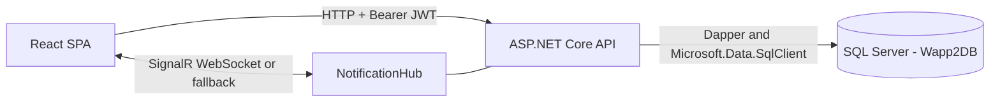
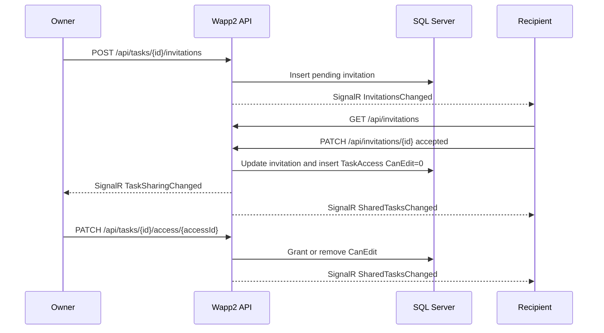
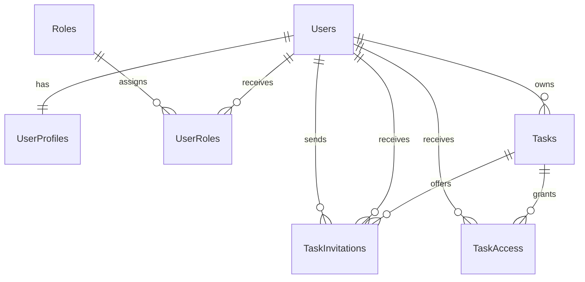

# Wapp2 Project Guide

## 1. Proposito

Wapp2 es una SPA multiusuario para gestionar tareas privadas y compartirlas con
otras cuentas registradas. El proyecto sirve como entorno practico para trabajar
con autenticacion JWT, autorizacion por recurso, SQL relacional, React y eventos
en tiempo real.

Este documento describe el sistema que existe actualmente en el repositorio. No
es una lista de ideas futuras. Las limitaciones y el trabajo pendiente para
produccion se documentan de forma separada al final.

## 2. Resumen funcional

Una persona puede:

- registrarse e iniciar sesion;
- crear, editar, completar, reabrir y eliminar sus tareas;
- mantener un perfil con nombre, apellido, biografia y URL de avatar;
- invitar por email a otra cuenta registrada para compartir una tarea;
- aceptar o rechazar invitaciones recibidas;
- consultar tareas compartidas con ella y tareas que ella comparte;
- recibir actualizaciones de invitaciones, acceso y tareas mediante SignalR;
- conceder o retirar permiso de edicion a cada colaborador;
- revocar por completo el acceso de un colaborador;
- eliminar su cuenta y los datos relacionados mediante una transaccion.

Las invitaciones no envian emails externos. El email funciona como identificador
de una cuenta que ya existe en Wapp2.

## 3. Arquitectura



El repositorio sigue un monolito modular:

- `full-web-app` contiene la SPA React.
- `wapp2` contiene la API principal ASP.NET Core.
- `Wapp2DB` es la fuente de verdad.
- `database/migrations` contiene cambios SQL incrementales versionados.
- `VideoGameCharacterApi` es una API anterior de referencia y no participa en
  el flujo de Wapp2.

No hay microservicios, broker de mensajes, Redis ni almacenamiento local que
reemplace a SQL Server en el flujo actual.

## 4. Stack y paquetes

### Frontend

| Tecnologia | Version declarada | Funcion |
| --- | --- | --- |
| React | `19.2.8` | Componentes y estado de la interfaz |
| React DOM | `19.2.8` | Renderizado en navegador |
| TypeScript | `~6.0.2` | Tipado y compilacion |
| Vite | `8.2.2` | Desarrollo y build |
| `@vitejs/plugin-react` | `6.1.0` | Integracion React con Vite |
| `@microsoft/signalr` | `10.0.11` | Cliente realtime |
| `lucide-react` | `1.42.0` | Iconografia |
| ESLint | `10.9.0` | Analisis estatico |
| `typescript-eslint` | `8.67.0` | Reglas ESLint para TypeScript |
| `@eslint/js` | `10.0.1` | Configuracion base de ESLint |
| `eslint-plugin-react-hooks` | `7.1.1` | Reglas de hooks de React |
| `eslint-plugin-react-refresh` | `0.5.4` | Reglas de Fast Refresh |
| `@types/node` | `24.13.3` | Tipos de Node para tooling |
| `@types/react` | `19.2.18` | Tipos de React |
| `@types/react-dom` | `19.2.4` | Tipos de React DOM |
| `globals` | `17.11.0` | Catalogo de globals para ESLint |

El frontend fija Node `>=24.15.0 <25` para mantener Vite, Vitest y jsdom sobre
una misma linea LTS reproducible.

### Testing frontend

| Tecnologia o paquete | Version declarada | Funcion |
| --- | --- | --- |
| Vitest | `5.0.0` | Runner de tests y mocks |
| `@vitest/coverage-v8` | `5.0.0` | Cobertura frontend |
| jsdom | `30.0.1` | DOM de navegador en Node |
| React Testing Library | `16.3.3` | Pruebas de componentes por comportamiento |
| `@testing-library/user-event` | `14.6.7` | Interacciones de usuario |
| `@testing-library/jest-dom` | `7.0.1` | Asserts semanticos del DOM |

### Backend

| Tecnologia o paquete | Version | Funcion |
| --- | --- | --- |
| .NET / ASP.NET Core | `net10.0` | API web y SignalR |
| Dapper | `2.1.79` | Mapeo y ejecucion de SQL explicito |
| Microsoft.Data.SqlClient | `7.0.2` | Conexion con SQL Server |
| JwtBearer | `10.0.11` | Validacion de JWT |
| BCrypt.Net-Next | `4.2.0` | Hash y verificacion de passwords |
| Microsoft.AspNetCore.OpenApi | `10.0.11` | Base para OpenAPI |

El paquete OpenAPI esta instalado, pero el proyecto todavia no configura un
documento OpenAPI ni una interfaz Swagger en `Program.cs`.

### Testing backend

| Tecnologia o paquete | Version | Funcion |
| --- | --- | --- |
| xUnit | `2.9.3` | Tests unitarios del dominio y servicios |
| Microsoft.AspNetCore.Mvc.Testing | `10.0.11` | Tests HTTP con host ASP.NET Core en memoria |
| Microsoft.NET.Test.Sdk | `17.14.1` | Descubrimiento y ejecucion de tests .NET |
| coverlet.collector | `6.0.4` | Recoleccion de cobertura |

## 5. Estructura del repositorio

```text
.
|-- README.md
|-- docs/
|   `-- PROJECT_GUIDE.md
|-- database/
|   `-- migrations/
|-- full-web-app/
|   |-- src/
|   |   |-- app/                 # shell, rutas y providers
|   |   |-- components/          # componentes reutilizables
|   |   |-- features/            # auth, profile, tasks, invitations, shared
|   |   |-- hooks/               # hooks transversales
|   |   |-- lib/                 # cliente HTTP
|   |   |-- styles/              # tokens, global, layout y app
|   |   `-- utils/
|   |-- package.json
|   `-- vite.config.ts
|-- tests/
|   `-- Wapp2.Tests/               # tests unitarios del backend
|-- wapp2/
|   |-- Auth/
|   |-- Users/
|   |-- Tasks/
|   |-- Invitations/
|   |-- Notifications/
|   |-- Shared/
|   |-- Program.cs
|   `-- wapp2.csproj
`-- VideoGameCharacterApi/       # referencia fuera del flujo principal
```

Cada dominio del backend separa sus responsabilidades en controladores, DTOs,
servicios, repositorios, modelos e interfaces cuando son necesarios.

## 6. Modulos y responsabilidades

### Auth

- registra cuentas;
- crea usuario, perfil inicial y rol `User` en una transaccion;
- aplica BCrypt al password;
- valida credenciales;
- genera JWT con identidad, email y roles.

### Users

- lee y actualiza el perfil del usuario autenticado;
- elimina solo el perfil mediante su endpoint especifico;
- elimina la cuenta completa despues de verificar el password;
- limpia accesos, invitaciones, notificaciones, tareas, roles y perfil dentro de
  una unica transaccion.

### Tasks

- gestiona el CRUD de tareas propias;
- obtiene tareas compartidas con el usuario;
- obtiene tareas propias que tienen invitaciones o accesos activos;
- autoriza actualizaciones de owner o colaborador con `CanEdit`;
- restringe borrado y administracion de acceso al owner.

### Invitations

- crea invitaciones para cuentas registradas;
- impide auto-invitaciones, accesos duplicados e invitaciones pendientes
  duplicadas;
- permite aceptar o rechazar una invitacion pendiente;
- crea `TaskAccess` con `CanEdit = 0` al aceptar;
- conserva un historial deduplicado por tarea y destinatario;
- permite al owner cancelar invitaciones que aun estan pendientes.

### Notifications

- expone el hub autenticado `/hubs/notifications`;
- publica eventos ligeros para que el frontend recargue datos;
- no guarda un inbox de notificaciones desde este modulo ni envia emails.

### Shared

- crea conexiones SQL;
- obtiene la identidad actual desde el JWT;
- normaliza errores HTTP;
- define la respuesta generica `ApiResponse<T>`.

## 7. Autenticacion y sesion

### Registro

1. El navegador envia email y password a `POST /api/auth/register`.
2. El backend comprueba que el email no exista.
3. BCrypt crea el hash del password.
4. Una transaccion inserta `Users`, `UserProfiles` y `UserRoles`.
5. El nombre inicial del perfil es la parte del email anterior a `@`.
6. La API devuelve un JWT.

### Login

1. El navegador llama a `POST /api/auth/login`.
2. El backend busca el usuario y verifica el hash con BCrypt.
3. La API devuelve un JWT con dos horas de validez.

### Contenido y validacion del JWT

El token incluye:

- `sub` y `NameIdentifier`: ID del usuario;
- `email` y claim de email;
- uno o mas claims de rol;
- fecha de expiracion.

ASP.NET Core valida firma, issuer, audience y expiracion. Despues comprueba que
la cuenta siga existiendo. Esto invalida de forma efectiva el token de una cuenta
eliminada aunque aun no haya llegado su fecha de expiracion.

El frontend guarda actualmente el token en `localStorage` con la clave
`wapp2.auth.token`, extrae ID, email y expiracion para representar la sesion y lo
envia como `Authorization: Bearer <token>` en las llamadas protegidas.

## 8. Flujo de tareas

1. El owner crea una tarea con titulo, descripcion, categoria, prioridad,
   estado, indicador de completada y fecha opcional.
2. El backend toma `OwnerUserId` del JWT. Nunca confia en un ID enviado por el
   navegador.
3. `GET /api/tasks/all` devuelve solo las tareas propias.
4. La vista principal combina esas tareas con las aceptadas desde
   `GET /api/tasks/shared`.
5. Las tareas ajenas muestran owner y permiso `View only` o `Can edit`.
6. Solo el owner ve acciones de compartir y eliminar.
7. Un colaborador con `CanEdit` puede editar contenido, estado, fecha y marcar la
   tarea como completada. No puede compartirla, administrar accesos ni borrarla.

El selector de fecha del frontend exige al menos cinco horas desde el momento
actual. Esta validacion todavia es solo del cliente y debe replicarse en el
backend antes de produccion.

## 9. Flujo de invitaciones y acceso



Reglas principales:

- solo el owner puede invitar;
- el destinatario debe tener una cuenta registrada;
- una tarea no puede invitar a su propio owner;
- no puede existir mas de una invitacion pendiente para la misma tarea y
  destinatario;
- no se puede invitar a quien ya tiene acceso;
- aceptar crea acceso de solo lectura;
- rechazar no crea acceso;
- revocar acceso conserva la ultima invitacion como historial, marcada sin
  acceso activo;
- una reinvitacion posterior sustituye visualmente el ciclo anterior en el
  historial deduplicado;
- borrar la tarea elimina antes sus accesos e invitaciones dentro de una
  transaccion.

## 10. Tiempo real

El cliente abre una conexion autenticada con:

```text
/hubs/notifications
```

SignalR usa `access_token` durante la negociacion del hub. El backend acepta ese
token solo para la ruta del hub.

Eventos actuales:

| Evento | Recurso que recarga el frontend |
| --- | --- |
| `InvitationsChanged` | invitaciones y badge de pendientes |
| `SharedTasksChanged` | tareas compartidas con el usuario |
| `TaskSharingChanged` | detalle de acceso y tareas compartidas por el owner |

Los eventos no contienen la tarea completa. Indican que un recurso cambio y el
frontend vuelve a consultar la API. De este modo SQL Server sigue siendo la
fuente de verdad y una reconexion puede recuperar el estado vigente.

El cliente usa reconexion automatica y reintenta el primer arranque cada cinco
segundos. En una instalacion con varias instancias de backend hara falta un
backplane, por ejemplo Redis, para distribuir eventos entre nodos.

## 11. Permisos

| Operacion | Owner | Colaborador view-only | Colaborador CanEdit | Otro usuario |
| --- | --- | --- | --- | --- |
| Ver en lista compartida | Si | Si | Si | No |
| Actualizar tarea | Si | No | Si | No |
| Completar o reabrir | Si | No | Si | No |
| Invitar usuarios | Si | No | No | No |
| Cambiar `CanEdit` | Si | No | No | No |
| Revocar acceso | Si | No | No | No |
| Eliminar tarea | Si | No | No | No |

Para recursos que no pertenecen al usuario, varios endpoints administrativos
responden `404` en lugar de confirmar que el recurso existe. Una actualizacion de
un colaborador view-only responde `403`.

## 12. Rutas de la SPA

| Ruta | Contenido |
| --- | --- |
| `/tasks` | tareas propias y tareas aceptadas compartidas con el usuario |
| `/invitations` | pendientes y ultimo estado historico por tarea |
| `/shared` | secciones `Shared with you` y `Shared by you` |
| `/profile` | perfil editable y eliminacion de cuenta |

La navegacion es una implementacion ligera con History API. El proyecto no usa
React Router actualmente.

## 13. API HTTP

Todos los endpoints salvo registro y login requieren JWT.

| Metodo | Ruta | Acceso | Proposito |
| --- | --- | --- | --- |
| `POST` | `/api/auth/register` | Publico | registrar cuenta |
| `POST` | `/api/auth/login` | Publico | iniciar sesion |
| `GET` | `/api/user/profile` | Usuario | cargar perfil propio |
| `PUT` | `/api/user/profile` | Usuario | actualizar perfil propio |
| `DELETE` | `/api/user/profile` | Usuario | eliminar solo el perfil |
| `DELETE` | `/api/user/account` | Usuario + password | eliminar cuenta y datos relacionados |
| `GET` | `/api/tasks/all` | Usuario | listar tareas propias |
| `POST` | `/api/tasks/create` | Usuario | crear tarea propia |
| `GET` | `/api/tasks/{id}` | Owner | obtener tarea propia |
| `PUT` | `/api/tasks/{id}` | Owner o `CanEdit` | actualizar tarea |
| `DELETE` | `/api/tasks/{id}` | Owner | eliminar tarea |
| `GET` | `/api/tasks/shared` | Usuario | tareas compartidas con el usuario |
| `GET` | `/api/tasks/shared/owned` | Owner | tareas propias con actividad de sharing |
| `GET` | `/api/tasks/{id}/sharing` | Owner | pendientes y miembros con acceso |
| `POST` | `/api/tasks/{id}/invitations` | Owner | invitar cuenta registrada |
| `GET` | `/api/invitations` | Destinatario | listar pendientes e historial |
| `PATCH` | `/api/invitations/{id}` | Destinatario | aceptar o rechazar |
| `DELETE` | `/api/invitations/{id}` | Owner | cancelar una invitacion pendiente |
| `PATCH` | `/api/tasks/{id}/access/{accessId}` | Owner | cambiar `CanEdit` |
| `DELETE` | `/api/tasks/{id}/access/{accessId}` | Owner | revocar acceso |

Perfil, invitaciones y vistas de sharing usan normalmente:

```json
{
  "success": true,
  "message": "Description of the result.",
  "data": {}
}
```

El CRUD base de tareas devuelve objetos o arrays directamente. Esta diferencia
es parte del contrato actual y es una candidata a normalizacion futura.

Codigos habituales:

- `200`: lectura o actualizacion correcta;
- `201`: tarea o invitacion creada;
- `204`: eliminacion o cambio sin body;
- `400`: payload invalido;
- `401`: sesion ausente, invalida o expirada;
- `403`: autenticado sin permiso para la operacion;
- `404`: recurso inexistente o no visible para ese usuario;
- `409`: conflicto de estado o duplicado.

## 14. Modelo de datos



Tablas utilizadas por el codigo principal:

- `dbo.Users`: identidad, email y hash del password;
- `dbo.UserProfiles`: nombre, apellido, URL de avatar y biografia;
- `dbo.Roles`: catalogo de roles;
- `dbo.UserRoles`: relacion usuario-rol;
- `dbo.Tasks`: contenido, owner, estado, prioridad y fechas;
- `dbo.TaskInvitations`: destinatario, remitente, estado y fechas;
- `dbo.TaskAccess`: permiso activo y `CanEdit`;
- `dbo.Notifications`: incluida en la limpieza de cuenta, sin flujo de inbox
  implementado en este repositorio.

La migracion versionada
`database/migrations/20260910_001_task_sharing_constraints.sql` agrega:

- bloqueo de invitaciones sin destinatario;
- indice unico para una invitacion pendiente por tarea y usuario;
- indices de consulta para invitaciones y accesos;
- constraint de integridad del destinatario;
- transaccion con `XACT_ABORT ON` y rollback ante error.

El repositorio aun no contiene una migracion baseline que cree toda la base desde
cero. La migracion de sharing presupone que las tablas base ya existen.

## 15. Configuracion local

### Requisitos

- .NET SDK 10;
- Node `^20.19.0` o `>=22.12.0`;
- npm;
- SQL Server accesible;
- base `Wapp2DB` con el esquema base y rol `User`.

### Secretos del backend

`wapp2.csproj` ya declara un `UserSecretsId`. Desde la raiz:

```bash
dotnet user-secrets set "ConnectionStrings:DefaultConnection" "<SQL_CONNECTION_STRING>" --project wapp2/wapp2.csproj
dotnet user-secrets set "Jwt:Secret" "<LONG_RANDOM_SECRET>" --project wapp2/wapp2.csproj
dotnet user-secrets set "Jwt:Issuer" "<JWT_ISSUER>" --project wapp2/wapp2.csproj
dotnet user-secrets set "Jwt:Audience" "<JWT_AUDIENCE>" --project wapp2/wapp2.csproj
```

No se deben versionar credenciales ni copiar secretos reales a README,
`appsettings.json` o `.env`.

Para comprobar las claves configuradas localmente:

```bash
dotnet user-secrets list --project wapp2/wapp2.csproj
```

### Base de datos

Antes de ejecutar SQL, comprobar siempre la instancia y base activas:

```sql
SELECT @@SERVERNAME AS ServerName, DB_NAME() AS CurrentDatabase;
```

Aplicar los scripts de `database/migrations` en orden sobre `Wapp2DB`. Por
ejemplo, con `sqlcmd` y autenticacion interactiva:

```bash
sqlcmd -S localhost,1433 -d Wapp2DB -U sa -C -i database/migrations/20260910_001_task_sharing_constraints.sql
```

### Frontend

```bash
cd full-web-app
cp .env.example .env.local
npm install
npm run dev
```

`.env.local` debe contener una URL sin `/api` y sin slash final:

```dotenv
VITE_API_URL=http://localhost:5104
```

### Backend

En otra terminal, desde la raiz:

```bash
dotnet run --project wapp2/wapp2.csproj --launch-profile http
```

Servicios locales:

- frontend: `http://localhost:5173`;
- API: `http://localhost:5104`;
- SignalR: `http://localhost:5104/hubs/notifications`.

El CORS actual permite exclusivamente `http://localhost:5173`.

## 16. Validacion

Backend:

```bash
dotnet build wapp2/wapp2.csproj --no-restore
dotnet test tests/Wapp2.Tests/Wapp2.Tests.csproj --no-restore
```

Frontend:

```bash
cd full-web-app
npm run lint
npm test
npm run test:coverage
npm run build
```

La suite frontend cubre el cliente HTTP, autenticacion de requests,
almacenamiento del token, fechas, errores, normalizacion de payloads de tareas y
los providers de autenticacion, SignalR e invitaciones. Esto incluye expiracion
de sesion, reintentos y eventos en tiempo real, aislamiento entre usuarios,
respuesta a invitaciones y limpieza automatica de mensajes. Todavia faltan hooks
y componentes interactivos.

La suite `Wapp2.Tests` cubre inicialmente registro y login, hashing de password,
generacion y validacion JWT, identidad basada en claims, cuenta y perfil de
usuario, ciclo de invitaciones, autorizacion de edicion, permisos, revocacion de
acceso y emision de eventos del servicio de tareas. Las pruebas HTTP verifican
el contrato `401`, firma y expiracion del JWT, cuentas eliminadas, propagacion de
identidad y autenticacion de la negociacion SignalR. Todavia no hay cobertura de
integracion con SQL Server o end-to-end. En particular, la traduccion de
conflictos de clave unica `2601/2627` requiere una prueba con SQL Server. Los
builds y lint no sustituyen esas pruebas.

## 17. Diagnostico rapido

### `401 Authentication is required`

- confirmar que existe `wapp2.auth.token`;
- comprobar expiracion del JWT;
- volver a iniciar sesion;
- confirmar que la cuenta no fue eliminada.

### Error de JWT al arrancar

Comprobar `Jwt:Secret`, `Jwt:Issuer` y `Jwt:Audience` en user-secrets. El codigo
falla rapido si falta cualquiera de esas claves.

### Error de conexion SQL

- confirmar servidor y nombre `Wapp2DB`;
- revisar `ConnectionStrings:DefaultConnection` en user-secrets;
- no volver a usar el nombre historico `EmployeeDb`.

### CORS en navegador

El origen debe ser exactamente `http://localhost:5173`. Otro puerto, hostname o
protocolo necesita una configuracion CORS explicita.

### La interfaz parece usar otra rama o una version antigua

Comprobar procesos duplicados y reiniciar Vite desde `full-web-app`:

```bash
lsof -nP -iTCP:5173 -sTCP:LISTEN
```

### No llegan cambios en tiempo real

- confirmar que API y frontend usan los puertos esperados;
- revisar la negociacion de `/hubs/notifications` en Network;
- comprobar que el JWT sigue vigente;
- usar `Refresh` para distinguir un fallo de SignalR de un fallo HTTP o SQL.

### `403` al editar una tarea compartida

El acceso existe, pero el owner no ha concedido `CanEdit` o acaba de retirarlo.

### `404` al administrar sharing

Los endpoints de administracion son exclusivos del owner y ocultan recursos no
autorizados con `404`.

## 18. Estado de produccion y trabajo pendiente

La aplicacion es funcional en local, pero no debe considerarse production-ready
sin cerrar al menos estos puntos:

1. Crear una migracion baseline reproducible para toda la base de datos.
2. Agregar validacion backend para fecha minima, email, password y reglas de los
   payloads de tareas.
3. Decidir una estrategia de sesion adecuada para produccion; el JWT vive ahora
   en `localStorage`, con el riesgo asociado ante XSS.
4. Hacer CORS configurable por ambiente y desplegar solo mediante HTTPS.
5. Agregar rate limiting, especialmente a register y login.
6. Activar OpenAPI/Swagger o publicar un contrato versionado.
7. Ampliar los tests unitarios, HTTP y frontend, y agregar integracion con SQL
   Server y E2E de los flujos multiusuario.
8. Incorporar CI para build, lint, tests, migraciones y analisis de seguridad.
9. Agregar health checks, logging estructurado y observabilidad.
10. Configurar un backplane SignalR si se ejecutan varias instancias.
11. Definir emails reales y notificaciones persistentes si el producto los
    necesita.
12. Implementar upload de avatar; actualmente solo se guarda una URL externa.
13. Revisar identificadores heredados como `RootNamespace=EmployeeManagementApi`.
14. Documentar backup, restore, rotacion de secretos y despliegue de migraciones.

## 19. Decisiones que deben mantenerse

- SQL Server es la fuente de verdad.
- La identidad efectiva siempre sale del JWT, no del body o query del cliente.
- Aceptar una invitacion concede inicialmente solo lectura.
- Solo el owner administra acceso y elimina la tarea.
- `CanEdit` no implica permiso para compartir, borrar o transferir ownership.
- Los eventos realtime invalidan datos; las lecturas HTTP recuperan el estado.
- `VideoGameCharacterApi` permanece fuera del flujo principal hasta que exista
  una decision explicita de migracion.
